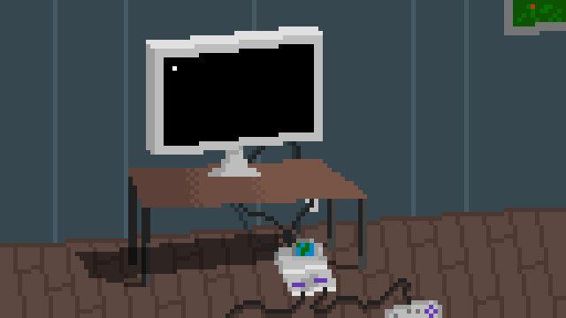

# Hey there! 👋

  

## 👨‍💻 About me:
I'm Grigorii Shcherbakov. I'm CS-student. Here you can see:
  - 🐱 Pet-Projects
  - 🧑‍🎓 University Projects
  - 🎯 Coding and algorithmic tasks solutions

## ✉️ How to chat me:
  - Telegram ✈️ [@shchff](https://t.me/shchff)
  - E-mail 📧 grisaserbakov0@gmail.com

## 📚 Stack

### 🖥️ Main Technologies:

  &nbsp;  
  &nbsp
  &nbsp;
  &nbsp;
  &nbsp;
  &nbsp;

### 💻 Additional Technologies:

  &nbsp;
  &nbsp;
  &nbsp;
  &nbsp;
  &nbsp;
  &nbsp;

### 🧰 Tools:

  &nbsp;
  &nbsp;
  &nbsp;
  &nbsp;

